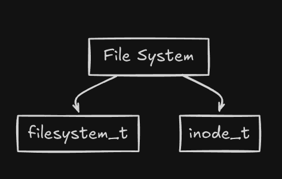
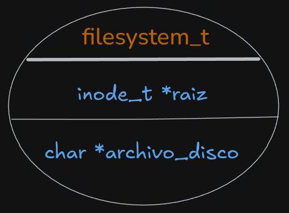
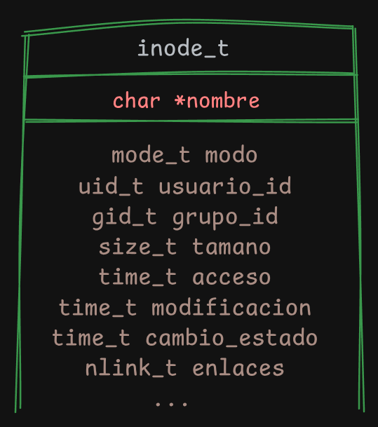
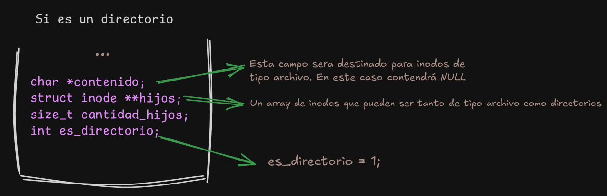
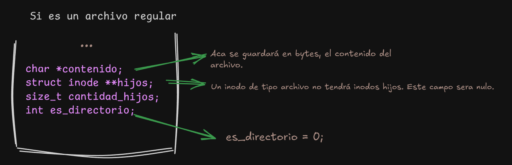

# fisop-fs

## Aspectos de diseño

### Estructuras en memoria del file system

La idea principal a la hora de crear el sistema de archivos es que sea simple y facil de implementar, utilizando las estructuras suficientes para cumplir con las tareas requeridas del trabajo. Estas estan ubicadas en el archivo fisopfs.h:

## `filesystem_t`

La estructura principal de nuestro file system. En él tendremos los siguientes 2 campos:

- **`raiz`**: Apunta a la raíz de nuestro árbol de inodos (explicado más adelante).
- **`archivo_disco`**: Contiene el nombre del archivo en el que se persistirán los datos del file system montado, independientemente de si es el predeterminado o no.

## `inode_t`

Esta estructura contiene un nombre, metadata (permisos de acceso, uid,gid, fechas de acceso y modificacion,tamaño en bytes, hard links)...

... y dependiendo de lo que diga la variable `es_directorio`, podemos tener 2 tipos de inodos:

Volviendo al inodo raiz del sistema, será siempre de tipo directorio, ya que de lo contrario, no podriamos crear un arbol de diferentes inodos, y por ende, no podria existir el file system.

### Busqueda de un archivo especifico dado un path
Para buscar un archivo o directorio usamos la funcion `buscar_inode(const char *path)`. Comienza verificando si la ruta corresponde a solamente "/". En ese caso, se devuelve `fs.raiz`. Caso contrario, divide la ruta en tokens usando a "/" como delimitador (con `strtok()`), y se va recorriendo el arbol de inodos hasta coincidir con todos los tokens. Una vez que logra esto, se devuelve el inodo correspondiente.

### Persistencia en disco

Para serializar la estructura de nuestro file system, vamos a usar la funcion `guardar_fs()`, el cual abrirá el archivo `fs.archivo_disco` y si no hay ningun problema de apertura, llamaremos a la funcion `guardar_inode(FILE *f, inode_t *node)`.Esta funcion empezara guardando todos los datos de `fs.raiz` y luego irá recorriendo todos los inodos para completar el objetivo. Para todo esto, se usará `fwrite()`.

Para la operacion contraria (deserializacion), usamos `cargar_fs()`.En él se busca abrir el archivo en modo "read binary", y en caso de que no exista, se especificara un mensaje diciendo que no se encuentra el archivo y llamara a `crear_inode()` para crear el punto de montaje del fs y guardarlo en `fs.raiz`. Si el archivo de persistencia existe, `fs.raiz` contendra el puntero al arbol de inodos restaurado, gracias a la funcion `cargar_inode(FILE *f)`. Esta ejecutará el metodo inverso a `guardar_inode()`, leyendo primero los datos para restaurar el root del sistema de archivos y luego irá recuperando la restante informacion, para alojarlo en los diferentes inodos correspondientes, utilizando `fread()`.