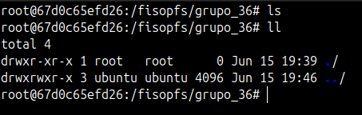
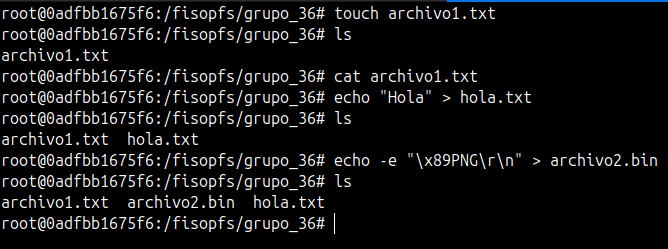
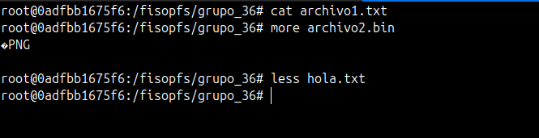
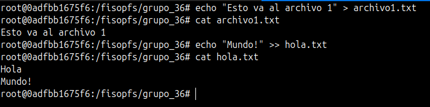
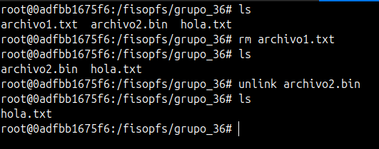
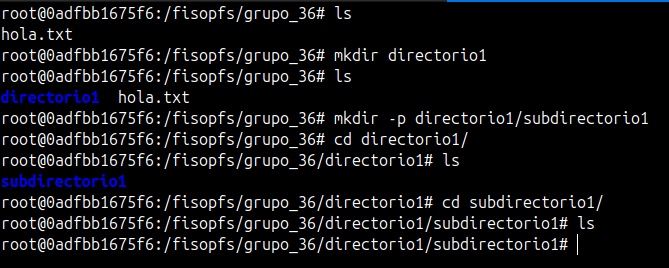
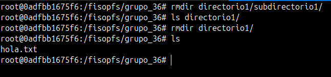
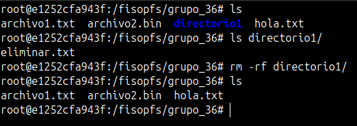
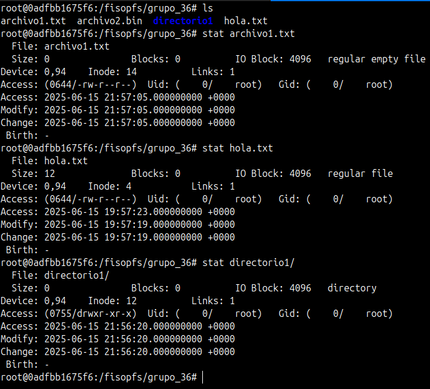
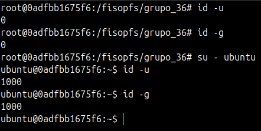

## TP3: FileSystem FUSE - Pruebas
### Grupo: 36
### Alumnos: Almada, Celano Minig, Fabregat, Fernández
#### Fecha de entrega: 15 de junio de 2025

## Estado inicial del FileSystem

## Archivos

- Se verifico si en nuestro *fs* se podían crear archivos usando: *touch*, *redirigiendo la salida del echo (ya sea a un archivo "común" o un archivo binario)*

- Se verifico si en nuestro *fs* se podían leer los archivos anteriormente creados.

- Se verifico si en nuestro *fs* se podía escribir sobre nuestros archivos, ya sea redirigiendo la salida de *echo* y truncar el archivo utilizando *>>*.

- Se verifico si en nuestro *fs* se podían borrar nuestros archivos usando el comando *rm* o *unlink*.

## Directorios

- Se verifico si en nuestro *fs* se podían crear directorios y/o subdirectorios.

- Se verifico si en nuestro *fs* se podían leer estos directorios y/o subdirectorios.

- Se verifico si en nuestro *fs* se podían borrar estos directorios (vacios).

- Se verifico si en nuestro *fs* se podían borrar estos directorios (con archivo dentro).

## Estadisticas y fechas

- Se verifico si en nuestro *fs* si se podia.

## Usuarios y grupos

- Se verifico si en nuestro *fs* se podían distinguir los usuarios y los grupos de estos.

