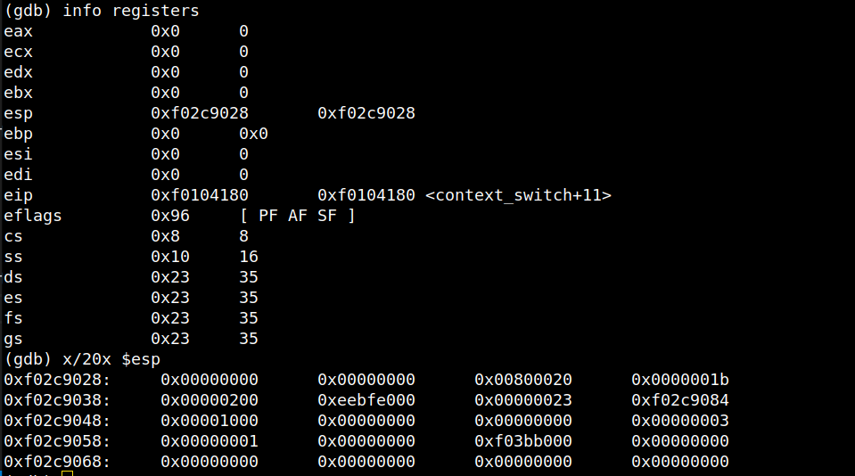

# sched

## Visualizacion del cambio de contexto: kernel a usuario.

### Para mostrar el cambio de contexto de kernel mode a user mode,usaremos al proceso `hello` como ejemplo de explicacion.

El proceso usa syscalls para imprimir por pantalla. Estas syscalls las maneja el kernel y una vez que terminan de ejecutarse cada una, se debe volver a modo usuario para seguir con el proceso principal. Nuestro camino comenzará desde la llamada de la siguiente funcion en `init.c`:
```C
    env_run(&envs[0]);
```
`env_run()` recibe el proceso y lo prepara para correr de vuelta en modo usuario. Si vemos el contenido de esta funcion, en principio se cambia el status del proceso (de RUNNABLE a RUNNING), el current environment pasará a ser el proceso dicho ,etc. Pero lo mas importante, o mejor dicho, lo que queremos darle mas atencion, es la anteultima linea:
```C
    context_switch(&e->env_tf);
```
`context_switch()` recibirá el trapframe del proceso para restaurar los datos a los registros de la CPU correspondientes culminando la restauracion total del proceso a modo usuario. Esta funcion
esta escrita en lenguaje ensamblador.

#### Ejecutando esta funcion, vamos a ver el paso a paso de como los registros van modificandose a medida que vayamos ejecutando las instrucciones de su cuerpo.

### Pero antes ... 

Veamos como está el stack, el trapframe del proceso y la informacion de registros:

- En la siguiente imagen vemos los primeros 20 elementos de 4 bytes donde la primera posicion superior izquierda esta almacenada la direccion de retorno y la siguiente posicion es la direccion de nuestro trapframe.
    

- El trapframe tiene el siguiente contenido. En ella, vemos la informacion que queremos restaurar, como por ejemplo, los registros de proposito general, segmentacion, etc.
    

- Un dato interesante a destacar, es que si nos fijamos la variable `tf_cs`, el valor almacenado se copiará en el registro Code Segment (`cs`). En nuestro caso, el valor es 27 (10), y sus ultimos 2 bits indican el nivel de privilegio que queremos cambiar. 27 en binario es 11011 donde 11 representa el 3 en base 10, que corresponde al nivel de privilegio usuario (`ring 3`). Si vemos los valores de los registros actualmente y hacemos foco en `cs`, sus ultimos 2 bits son 00,ya que estamos en modo kernel (`ring 0`). El 8 (10) en binario es 1000

    


### Volviendo a la ejecucion de context_switch...

1. ... ejecutaremos la siguiente linea que movera el puntero del stack 4 bytes hacia abajo.
    ```asm
        add $4, %esp
    ```

    Los registros y la pila quedan de la siguiente forma:
    

2. Luego ejecutaremos las siguiente 2 lineas, en la cual buscamos que `esp` almacene el valor del tope de la pila mostrada en la anterior imagen. Con esto, hacemos que el stack pointer apunte a la pila donde estan guardados los valores del trapframe del proceso que queremos restaurar en los registros

    ```asm
        mov (%esp), %eax
        mov %eax, %esp
    ```

    Y hasta ahora, los valores de los registros y de la pila son los siguientes:
    


3. La pila ahora tiene los datos del trapframe del proceso actual. En principio tenemos los datos
de los registros generales. Con la siguiente instruccion, restauraremos los valores de los registros con respecto al orden del stack: edi, esi, ebp, esp (ignorado), ebx, edx, ecx, eax
    ```asm
        popal
    ```

    Ejecutando esta ultima instruccion, el estado de los registros y la pila quedan de la siguiente forma:
    


4. Pasamos a la siguientes instrucciones, que copiaran los datos en los registros `ds` y `es`,respectivamente.
    ```asm
        pop %ds
        pop %es
    ```

    Los registros y la pila hasta el momento, se muestran a continuacion:
    

5. Ahora hacemos que el stack pointer apunte 8 bytes hacia abajo del tope, ya que queremos ignorar esos valores almacenados.
    ```asm
        add $8, %esp
    ```

    El estado actual de los registros y la pila son:
    

6. Y para cerrar, ejecutamos la ultima instruccion:

    ```asm
        iret
    ```

    Esta instruccion revertirá automáticamente lo que hizo el procesador al atender la interrupción de software.Esto es, almacenar algunos datos de la pila en los registros que se mencionan a continuacion:

    `eip` -> registro especial que tendrá la direccion para volver a la instruccion donde ocurrio la interrupcion (llamada a la syscall).

    `cs` -> registro de segmento en el cual los ultimos 2 bits cambiaran de valor luego de ejecutar `iret`, ya que pasamos a nivel de privilegio de usuario.

    `eflags` -> aca se guardan los flags del CPU como estaban antes de la interrupción.

    `esp` -> tendrá la direccion de pila del proceso de usuario

    `ss` -> otro registro de segmento

    #### Con esto ultimo, la funcion termina de procesarse y genera la vuelta de la ejecucion del environment a nivel de usuario. El estado final de los registros queda finalmente de la siguiente manera:
    

## Scheduler con prioridades
La lógica del scheduler con prioridades consiste en asignar a todos los procesos el valor máximo de prioridad al momento de su creación. Una vez que se llama a sched_yield(), se elegirá siempre el proceso con más prioridad para ser ejecutado y se la reducirá en uno cada vez. Por otro lado, aquellos procesos que tarden más de tres llamadas al scheduler en ser ejecutados verán su prioridad aumentada en uno.

Para la implementación de esta lógica se agregó al struct Env la variable "env_priority", que se inicializa con la constante HIGHEST_PRIORITY (que toma el valor 5) durante env_alloc() y se aumenta o reduce según las decisiones que toma el scheduler. Para decidir cuándo se aumenta la prioridad de los procesos se agregó también la variable "env_wait_time", que aumenta en uno para todos los procesos cuando sucede una llamada al scheduler y se devuelve a 0 para el proceso elegido. El env_wait_time de cada proceso se compara con la variable global MAX_WAIT_TIME (que vale 3) para decidir si debe o no aumentar su prioridad.
